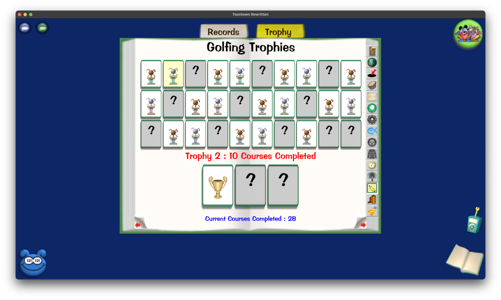

# Lily's Toontown Rewritten Calculator Suite
## Welcome and Program Overview  
Welcome! This document is a written tutorial for the suite of Toontown Rewritten Calculators. This program has 3 main functions. In it is a  Cog Suit Calculator, Golf Trophy Calculator, and a Racing Trophy Calculator. Each of these has its own section, but here is a high-level overview of what each does.  

In the Cog Suit calculator, you select a Cog type, and the program will tell you which Cog facilities (i.e. Mints) you should do to earn your next promotion. You can choose to tell it your Cog Disguise suit and level, or you can choose to input the actual number of Stock Options / Jury Notices / Cogbucks / Merits that you need.  

The Golf Trophy Calculator asks you a series of questions about how many courses you've completed in different categories. It then tells you how many Golf trophies you've earned. Your answers to these questions are stored in two files, so that you don't have to re-enter them.

The Racing Trophy Calculator does the same thing as the Golf calculator, but for racing instead of golf.

One quick note is that even though all of the screenshots are on a Mac, it should look very similar in Windows.

With that out of the way, let's get in to using the program!

## The Main Menu
The main menu is what you see when you first run the program, and is the starting point for all of the other functions of the program. As shown below, there are 4 options. These will have their own sections later.  
Option 1 takes you to a menu for the Cog Suit calculators.  
Option 2 takes you to a menu for the Golf Trophy calculator.  
Option 3 takes you to a menu for the Racing Trophy calculator.  
Option 4 quits the program.  
Entering anything other than a number between 1 and 4 won't do anything. The screen will be cleared and you'll be shown the same options again.

## Option 1: Cog Suit Calculators
This option takes you to the Cog Suit Calculators page. Entering a number from 1 to 4 will take you to the respective Cog page. Entering 5 will take you back to the main menu. This part of the program is mostly self-explanatory, but feel free to read on for more details!

### Bossbot Suit Calculator
This is the Bossbot Suit Calculator menu. From here, you have a choice. This is where you can tell the program that you want to enter your Cog Suit and Cog Level. You can also tell the program that you want to input a specific number of Stock Options.

If you enter option 1, you can input your Cog's name and the suit level. Here, I entered `The Big Cheese` for the Cog name and `25` for the Cog level, but you can put whichever Cog you want in here! Once you've input the Cog's name and the suit level, the program will tell you how many Stock Options you need to be ready for promotion. Below that, it will tell you which Cog Golf Course(s) you should do. From here, the program will ask you if you want to go back to the Cog Menu, or if you want to quit the program. An example is shown below:

If you enter option 2, you can directly enter the number of Stock Options you need. The program will tell you which Cog Golf Course(s) you should do.

### Lawbot Suit Calculator
This is the Lawbot Suit Calculator menu. Just like in the Bossbot Calculator, you can either tell the program you want to input the Cog Suit and level, or the specific number of Jury Notices you need.

If you enter option 1, you can input your Cog's name and the suit level. Here, I entered `Ambulance Chaser` for the Cog name and `7` for the Cog level. Just like before, once you've input the Cog's name and the suit level, the program will tell you how many Jury Notices you need to be ready for promotion. Below that, it will tell you which DA Office(s) you should do.

If you enter option 2, you can directly enter the number of Jury Notices you need. The program will tell you which DA Office(s) you should do.

### Cashbot Suit Calculator
This is the Cashbot Suit Calculator menu. Just like in the other calculators, you can either tell the program you want to input the Cog Suit and level, or the specific number of Cogbucks you need.  
One issue with the Cashbot calculator is that there's no way for it to be 100% accurate. This is because the Cashbot Mints have some variability to them. Each of the 3 Mints (Coin, Dollar, and Bullion) have 20 separate floors, and there's no way to know which you'll get until you actually get into the Mint. Each floor has a different layout and a different number of Cogs. Most importantly for this calculator, however, each one of the 20 different floors has a different number of Cogbucks that will be awarded. This is echoed in the program.

If you enter option 1, you can input your Cog's name and the suit level. The warning I mentioned in the section above is echoed at the top of the window. Just like with the other two calculators, the program will tell you which Mint(s) you should do.

If you enter option 2, you can directly enter the number of Cogbucks you need. The program will tell you which Mint(s) you should do.

### Sellbot Suit Calculator
Lastly, this is the Sellbot Suit Calculator menu. In the Sellbot Suit Calculator, the program first asks you if you are able to do Field Offices. If you're not sure what a Field Office is, just enter "N".  

If you're able to do field offices, then the program will let you know that it's faster to do Field Offices than it is to do Factories. You are then given a choice to check how many Factories you should do anyway. It's up to you which you want to do.
 
Just like in the other calculators, you can either tell the program you want to input the Cog Suit and level, or the specific number of Merits you need. 

If you enter option 1, you can input your Cog's name and the suit level. Just like with the other two calculators, the program will tell you which Factory/Factories you should do.

If you enter option 2, you can directly enter the number of Merits you need. The program will tell you which Factory/Factories you should do.

## Option 2: Golf Trophy Calculator
This option takes you to the Golf Trophy Calculator page. From here, you can choose to:

1. Update your Golf Progress
2. View your current Golf progress
3. Reset your golf progress
4. Go back to the main menu

It's worth mentioning that the program will automatically save your progress after you enter it for the first time. This means you don't have to re-enter it each time you want to run the program. Convenient!

### Updating Golf Progress
If you enter 1, you can update your progress. There are 30 trophies in total, split into 10 sets of 3. The program will ask you a series of questions about each of the 10 different trophy categories. You're probably asking yourself, how do I find this information? It's actually really easy! In your Shticker Book, go to the Golf page, and click on the Trophy tab at the top.

As an example, the first question the program asks is: `How many courses have you completed?`  
To find this, hover your mouse over any of the first three trophies, just like it's shown below.

The number of Courses Completed is shown in **blue text**, at the bottom of your Shticker Book.

In general, if you split the trophies into groups of 3, each of the groups will have its own question. If you hover over any of the trophies in that group (assuming that you've earned any), you'll see your progress towards completing all 3 trophies in that group. Again, this is shown in **blue text** at the bottom of your Shticker Book. I've marked each group in its own color in the picture below. 

Once you've entered your progress, it will be stored in two files: one that tracks the numbers you entered and one that tracks whether or not each trophy was completed.

### Viewing Current Golf Progress
Since your progress is saved to files, you can view it again at any point, even if you quit and re-run the program! When you choose option 2 in the main Golf menu, you'll have some options. 

With the first option, you can view the total number of trophies you've completed.  
With the second option, you can view more detailed progress for each of the 10 trophy categories. 
#### Option 1: Total Completed Trophies
This option simply tallies the total number of trophies you've completed. This is calculated based on your input.

#### Option 2: More Detailed Progress
This option gives more detail about your progress. It shows you your progress in each category, and also tells you how close you are to earning your next trophy.

### Resetting Current Golf Progress
Sometimes, we all need a fresh start. I get it, so that's why I added the ability to reset your Golf progress! **Warning:** this will completely zero all of your entered progress, which *cannot* be undone by pressing `Ctrl/Cmd + Z`. You'll have to manually re-enter it if you choose to reset. It's better to just update the progress instead of resetting it then re-entering it.

## Option 3: Racing Trophy Calculator

This option takes you to the Racing Trophy Calculator page. Most of the "how-to" info in the Golf section carries over, with a few differences that I'll highlight here.
### Updating Racing Trophy Progress
For Racing, each row of trophies is its own category.  
The first row is for Races Qualified.  
The second row is for Races Won.  
The third row is for Tournament trophies. Toontown calls the trophies "tournament", but in-game, this "tournament" is actually the Grand Prix that happens every Monday (and part of Saturday).  

Each row has 3 sub-categories for each of the 3 track types: Speedway (the gray courses), Rural (the red courses), and Urban (the yellow courses). The last trophy in each row is for overall progress in that row. **This is calculated automatically.**

The program will ask you for similar input to the Golf program. Finding this info is the exact same as in the Golf program. Again, the last trophy in each row is calculated for you automatically.

The last 2 questions are for the last 2 trophies. These are yes/no questions. If you have the trophy in question, enter `Y`. If you don't, enter `N`.

### Viewing Racing Trophy Progress
Just like in the Golf program, you can either view the total number of trophies you've earned, or you can view more detailed progress for each trophy category. The lines that start with "`In total you have...`" were calculated automatically for you.

### Resetting Current Racing Progress
Just like in the Golf program, this option will zero out all of your Racing progress, **which cannot be undone**.
## Leaving Feedback
If you've made it this far, thank you so much for reading this and using the program, which I really hope you'll do after reading this if you haven't yet! I would *really* appreciate if you would leave me some feedback on what you liked about the program, what I could improve on, etc. If you'd like to give feedback, you can fill out [this Google Form](https://forms.gle/G6UYKekdmxetTCbW7). I'll read *any and all* feedback, good or bad! 